# Infrastructure as Code (IaC) - Complete Learning Guide

## 🚀 **Bottom Line Up Front (BLUF)**

Infrastructure as Code (IaC) dramatically reduces deployment times and operational overhead by allowing you to define infrastructure requirements in code rather than manually configuring hardware or virtual machines. This approach brings enhanced operational efficiency, consistency across environments, and automatic change tracking through version control.

---

## 📋 Table of Contents

1. [What is Infrastructure as Code](#what-is-infrastructure-as-code)
2. [Benefits of IaC](#-benefits-of-iac)
3. [IaC Tool Categories](#iac-tool-categories)
4. [Terraform Deep Dive](#terraform-deep-dive)
5. [Ansible Deep Dive](#ansible-deep-dive)
6. [Terraform vs Ansible](#terraform-vs-ansible)
7. [Terraform on AWS](#terraform-on-aws)
8. [Terraform on Azure](#terraform-on-azure)
9. [Best Practices](#best-practices)
10. [Getting Started](#getting-started)
11. [Advanced Topics](#advanced-topics)
12. [Troubleshooting](#troubleshooting)
13. [Resources & References](#resources--references)

---

## 🔧 What is Infrastructure as Code?

Infrastructure as Code (IaC) is the practice of managing and provisioning IT infrastructure—like servers, networks, and databases—through machine-readable configuration files, rather than manual processes. Instead of setting up a server by clicking through a cloud provider's web UI, you write code that defines the server configuration.


### Key Concepts

| Concept | Description | Example |
|---------|-------------|---------|
| **Declarative** | You describe what you want, not how to achieve it | "I want 3 web servers" |
| **Imperative** | You specify the exact steps to achieve the result | "Create server 1, then server 2, then server 3" |
| **Idempotency** | Running the same code multiple times produces the same result | Re-running creates only missing resources |
| **State Management** | Tracking the current state of your infrastructure | Knowing which resources exist and their configuration |

---

## 🎯 Benefits of IaC

IaC brings significant benefits in maintaining compliance and simplifying the audit process. Through version control, IaC ensures every change to the infrastructure is tracked and documented, creating a transparent, auditable history.

### **Speed and Efficiency**

- Dramatically reduces deployment times and operational overhead
- Automated provisioning eliminates manual configuration steps
- Parallel resource creation where possible

### **Consistency and Reliability**

- Cost efficiency as infrastructure costs are lowered due to decreased time to deploy, effort to manage, administer and maintain environments
- Eliminates configuration drift between environments
- Ensures development, staging, and production environments are identical

### **Version Control and Collaboration**

- Infrastructure changes tracked like application code
- Code reviews for infrastructure changes
- Rollback capabilities for failed deployments
- Team collaboration through shared repositories

### **Cost Optimization**

- Automating infrastructure provisioning through code eliminates time-consuming manual tasks, allowing your team to focus on more strategic initiatives
- Resource optimization through automated scaling
- Prevention of over-provisioning


---

## 🛠️ IaC Tool Categories

IaC tools automate the process of setting up, modifying, and maintaining the IT infrastructure. They are the key to efficient infrastructure management, enabling businesses to deliver stable environments rapidly and at scale.


### Tool Categories Comparison

| Category | Purpose | Examples | Best For |
|----------|---------|----------|----------|
| **Provisioning** | Create infrastructure resources | Terraform, CloudFormation | Setting up cloud resources, networks, databases |
| **Configuration Management** | Configure existing systems | Ansible, Chef, Puppet | Installing software, managing configurations |
| **Server Templating** | Create reusable server images | Docker, Packer, Vagrant | Standardized server deployments |
| **Orchestration** | Manage complex system interactions | Kubernetes, Docker Swarm | Container management, microservices |

---

## 🔷 Terraform Deep Dive

Terraform is an open-source Infrastructure as Code (IaC) tool created by HashiCorp. It allows you to define and manage cloud and on-premises infrastructure using a declarative configuration language called HCL (HashiCorp Configuration Language).

### **Core Concepts**


### **Key Features**

| Feature | Description | Benefit |
|---------|-------------|---------|
| **Declarative Syntax** | Describe desired end state | Terraform figures out how to achieve it |
| **Provider Ecosystem** | Supports over 3k providers | Works with any API-driven service |
| **State Management** | Tracks current infrastructure state | Enables updates, deletions, and drift detection |
| **Plan and Apply** | Preview changes before execution | Prevents unexpected modifications |
| **Resource Dependencies** | Automatic dependency resolution | Ensures correct creation/destruction order |

### **Terraform Workflow**


### **Basic Terraform Configuration**

```hcl
# Configure the AWS Provider
terraform {
  required_providers {
    aws = {
      source  = "hashicorp/aws"
      version = "~> 5.0"
    }
  }
}

provider "aws" {
  region = "us-west-2"
}

# Create a VPC
resource "aws_vpc" "main" {
  cidr_block           = "10.0.0.0/16"
  enable_dns_hostnames = true
  enable_dns_support   = true
  
  tags = {
    Name        = "main-vpc"
    Environment = "development"
  }
}

# Create an Internet Gateway
resource "aws_internet_gateway" "main" {
  vpc_id = aws_vpc.main.id
  
  tags = {
    Name = "main-igw"
  }
}

# Create a subnet
resource "aws_subnet" "public" {
  vpc_id                  = aws_vpc.main.id
  cidr_block              = "10.0.1.0/24"
  availability_zone       = "us-west-2a"
  map_public_ip_on_launch = true
  
  tags = {
    Name = "public-subnet"
  }
}
```

---

## 🔶 Ansible Deep Dive

Ansible is a software and system management automation platform that facilitates IT workflows and increases productivity. It's written in Python and backed by RedHat, with a loyal open-source community.

### **Core Concepts**


### **Key Features**

| Feature | Description | Benefit |
|---------|-------------|---------|
| **Agentless** | No need to deploy agents on machines for operational purposes | Simpler deployment and maintenance |
| **YAML Syntax** | A popular, simple data format that is easy for humans to understand | Lower learning curve |
| **Idempotent** | Safe to run multiple times | No unintended side effects |
| **Push Model** | Pushes configuration from control node | Real-time execution |
| **Large Module Library** | Extensive built-in modules | Covers most automation needs |

### **Ansible Architecture**


### **Basic Ansible Playbook**

```yaml
---
- name: Configure web servers
  hosts: webservers
  become: yes
  
  vars:
    http_port: 80
    max_clients: 200
    
  tasks:
    - name: Install Apache
      package:
        name: httpd
        state: present
        
    - name: Start Apache service
      service:
        name: httpd
        state: started
        enabled: yes
        
    - name: Deploy index.html
      template:
        src: index.html.j2
        dest: /var/www/html/index.html
        owner: apache
        group: apache
        mode: '0644'
      notify: restart apache
      
  handlers:
    - name: restart apache
      service:
        name: httpd
        state: restarted
```

### **Inventory Example**

```ini
[webservers]
web1.example.com ansible_host=192.168.1.10
web2.example.com ansible_host=192.168.1.11

[databases]
db1.example.com ansible_host=192.168.1.20

[production:children]
webservers
databases

[production:vars]
ansible_user=ubuntu
ansible_ssh_private_key_file=~/.ssh/production_key
```

---

## ⚖️ Terraform vs Ansible

While both tools can handle aspects of infrastructure management, Terraform is typically used for "Day 0" activities, such as setting up the initial infrastructure, while Ansible is used for "Day 1 and beyond" tasks, focusing on configuring and maintaining systems.

### **Detailed Comparison**

```mermaid
graph TD
    A[Infrastructure Lifecycle] --> B[Day 0: Provision]
    A --> C[Day 1: Configure]
    A --> D[Day 2: Maintain]
    
    B --> E[Terraform<br/>🏗️ Build Infrastructure]
    C --> F[Ansible<br/>⚙️ Configure Systems]
    D --> G[Both<br/>🔄 Ongoing Management]
    
    E --> H[Create VPCs<br/>Launch EC2 Instances<br/>Setup Load Balancers]
    F --> I[Install Software<br/>Configure Services<br/>Deploy Applications]
    G --> J[Updates<br/>Patches<br/>Scaling]
    
    style B fill:#e3f2fd
    style C fill:#f3e5f5
    style D fill:#e8f5e8
```



| Aspect | Terraform | Ansible |
|--------|-----------|---------|
| **Primary Purpose** | Infrastructure Provisioning | Configuration Management |
| **Approach** | Declarative - define desired end state | Hybrid - can be both declarative and procedural |
| **State Management** | Maintains state file | Stateless (checks current state each run) |
| **Language** | HCL (HashiCorp Configuration Language) | YAML |
| **Agent Requirements** | Agentless | Agentless |
| **Best For** | Creating servers, networks, databases in the cloud | Installing software, setting up users, updating applications |
| **Dependency Management** | Automatic dependency graphs | Manual dependency definition |
| **Multi-Cloud** | Native multi-cloud support | Requires cloud-specific modules |

### **When to Use Each**

#### **Use Terraform When:**

- Focused on creating or managing infrastructure like provisioning servers, setting up networks, or creating cloud resources
- Need to track infrastructure state
- Working with multiple cloud providers
- Building immutable infrastructure
- Need dependency management for complex infrastructures

#### **Use Ansible When:**

- Want to configure servers, install software, set system configurations, or manage services after infrastructure is set up
- Need to manage existing systems
- Performing application deployments
- Running operational tasks and maintenance
- Need complex orchestration workflows

### **Using Terraform and Ansible Together**


---

## ☁️ Terraform on AWS

Managing infrastructure as code (IaC) with Terraform on AWS offers important benefits such as improved consistency, security, and agility.

### **AWS Provider Setup**

```hcl
terraform {
  required_version = ">= 1.0"
  required_providers {
    aws = {
      source  = "hashicorp/aws"
      version = "~> 5.0"
    }
  }
  
  backend "s3" {
    bucket = "my-terraform-state"
    key    = "infrastructure/terraform.tfstate"
    region = "us-west-2"
  }
}

provider "aws" {
  region = var.aws_region
  
  default_tags {
    tags = {
      Environment = var.environment
      Project     = var.project_name
      ManagedBy   = "Terraform"
    }
  }
}
```

### **Common AWS Resources with Terraform**

#### **1. VPC and Networking**

```hcl
# VPC
resource "aws_vpc" "main" {
  cidr_block           = "10.0.0.0/16"
  enable_dns_hostnames = true
  enable_dns_support   = true
  
  tags = {
    Name = "${var.project_name}-vpc"
  }
}

# Internet Gateway
resource "aws_internet_gateway" "main" {
  vpc_id = aws_vpc.main.id
  
  tags = {
    Name = "${var.project_name}-igw"
  }
}

# Public Subnet
resource "aws_subnet" "public" {
  count = length(var.availability_zones)
  
  vpc_id            = aws_vpc.main.id
  cidr_block        = "10.0.${count.index + 1}.0/24"
  availability_zone = var.availability_zones[count.index]
  
  map_public_ip_on_launch = true
  
  tags = {
    Name = "${var.project_name}-public-${count.index + 1}"
    Type = "public"
  }
}

# Route Table
resource "aws_route_table" "public" {
  vpc_id = aws_vpc.main.id
  
  route {
    cidr_block = "0.0.0.0/0"
    gateway_id = aws_internet_gateway.main.id
  }
  
  tags = {
    Name = "${var.project_name}-public-rt"
  }
}

# Route Table Association
resource "aws_route_table_association" "public" {
  count = length(aws_subnet.public)
  
  subnet_id      = aws_subnet.public[count.index].id
  route_table_id = aws_route_table.public.id
}
```

#### **2. Security Groups**

```hcl
resource "aws_security_group" "web" {
  name_prefix = "${var.project_name}-web-"
  vpc_id      = aws_vpc.main.id
  description = "Security group for web servers"
  
  # HTTP
  ingress {
    from_port   = 80
    to_port     = 80
    protocol    = "tcp"
    cidr_blocks = ["0.0.0.0/0"]
    description = "HTTP"
  }
  
  # HTTPS
  ingress {
    from_port   = 443
    to_port     = 443
    protocol    = "tcp"
    cidr_blocks = ["0.0.0.0/0"]
    description = "HTTPS"
  }
  
  # SSH (restricted)
  ingress {
    from_port   = 22
    to_port     = 22
    protocol    = "tcp"
    cidr_blocks = [var.admin_cidr]
    description = "SSH admin access"
  }
  
  # All outbound traffic
  egress {
    from_port   = 0
    to_port     = 0
    protocol    = "-1"
    cidr_blocks = ["0.0.0.0/0"]
    description = "All outbound"
  }
  
  tags = {
    Name = "${var.project_name}-web-sg"
  }
  
  lifecycle {
    create_before_destroy = true
  }
}
```

#### **3. EC2 Instances with Auto Scaling**

```hcl
# Launch Template
resource "aws_launch_template" "web" {
  name_prefix   = "${var.project_name}-web-"
  image_id      = data.aws_ami.amazon_linux.id
  instance_type = var.instance_type
  
  vpc_security_group_ids = [aws_security_group.web.id]
  
  user_data = base64encode(templatefile("${path.module}/user-data.sh", {
    project_name = var.project_name
  }))
  
  tag_specifications {
    resource_type = "instance"
    tags = {
      Name = "${var.project_name}-web"
    }
  }
  
  lifecycle {
    create_before_destroy = true
  }
}

# Auto Scaling Group
resource "aws_autoscaling_group" "web" {
  name                = "${var.project_name}-web-asg"
  vpc_zone_identifier = aws_subnet.public[*].id
  target_group_arns   = [aws_lb_target_group.web.arn]
  health_check_type   = "ELB"
  
  min_size         = var.min_instances
  max_size         = var.max_instances
  desired_capacity = var.desired_instances
  
  launch_template {
    id      = aws_launch_template.web.id
    version = "$Latest"
  }
  
  tag {
    key                 = "Name"
    value              = "${var.project_name}-web-asg"
    propagate_at_launch = false
  }
}
```

### **AWS Best Practices with Terraform**

| Practice | Description | Example |
|----------|-------------|---------|
| **Use Remote State** | Store state in S3 with DynamoDB locking | S3 backend with versioning enabled |
| **Tag Everything** | Consistent tagging strategy | Environment, Project, Owner, CostCenter |
| **Use Data Sources** | Reference existing resources | `data "aws_ami" "latest"` |
| **Implement Modules** | Reusable infrastructure components | VPC module, EC2 module |
| **Environment Separation** | Separate state files per environment | dev/, staging/, prod/ directories |

---

## ☁️ Terraform on Azure

Using Terraform on Azure, you can create, manage, and update resources like virtual machines, storage accounts, and networking interfaces, ensuring consistent and reproducible infrastructure deployment across different environments.

### **Azure Provider Setup**

```hcl
terraform {
  required_providers {
    azurerm = {
      source  = "hashicorp/azurerm"
      version = "~> 3.0"
    }
  }
}

provider "azurerm" {
  features {
    resource_group {
      prevent_deletion_if_contains_resources = false
    }
    
    virtual_machine {
      delete_os_disk_on_deletion = true
    }
  }
}

# Configure backend for remote state
terraform {
  backend "azurerm" {
    resource_group_name  = "terraform-rg"
    storage_account_name = "terraformstateaccount"
    container_name      = "tfstate"
    key                 = "infrastructure.tfstate"
  }
}
```

### **Common Azure Resources**

#### **1. Resource Group and Networking**

```hcl
# Resource Group
resource "azurerm_resource_group" "main" {
  name     = "${var.project_name}-rg"
  location = var.location
  
  tags = {
    Environment = var.environment
    Project     = var.project_name
  }
}

# Virtual Network
resource "azurerm_virtual_network" "main" {
  name                = "${var.project_name}-vnet"
  address_space       = ["10.0.0.0/16"]
  location            = azurerm_resource_group.main.location
  resource_group_name = azurerm_resource_group.main.name
  
  tags = {
    Environment = var.environment
  }
}

# Subnet
resource "azurerm_subnet" "web" {
  name                 = "web-subnet"
  resource_group_name  = azurerm_resource_group.main.name
  virtual_network_name = azurerm_virtual_network.main.name
  address_prefixes     = ["10.0.1.0/24"]
}

# Network Security Group
resource "azurerm_network_security_group" "web" {
  name                = "${var.project_name}-web-nsg"
  location            = azurerm_resource_group.main.location
  resource_group_name = azurerm_resource_group.main.name
  
  security_rule {
    name                       = "HTTP"
    priority                   = 1001
    direction                  = "Inbound"
    access                     = "Allow"
    protocol                   = "Tcp"
    source_port_range          = "*"
    destination_port_range     = "80"
    source_address_prefix      = "*"
    destination_address_prefix = "*"
  }
  
  security_rule {
    name                       = "HTTPS"
    priority                   = 1002
    direction                  = "Inbound"
    access                     = "Allow"
    protocol                   = "Tcp"
    source_port_range          = "*"
    destination_port_range     = "443"
    source_address_prefix      = "*"
    destination_address_prefix = "*"
  }
  
  tags = {
    Environment = var.environment
  }
}
```

#### **2. Virtual Machines**

```hcl
# Public IP
resource "azurerm_public_ip" "web" {
  count               = var.instance_count
  name                = "${var.project_name}-web-${count.index + 1}-pip"
  location            = azurerm_resource_group.main.location
  resource_group_name = azurerm_resource_group.main.name
  allocation_method   = "Static"
  sku                = "Standard"
  
  tags = {
    Environment = var.environment
  }
}

# Network Interface
resource "azurerm_network_interface" "web" {
  count               = var.instance_count
  name                = "${var.project_name}-web-${count.index + 1}-nic"
  location            = azurerm_resource_group.main.location
  resource_group_name = azurerm_resource_group.main.name
  
  ip_configuration {
    name                          = "internal"
    subnet_id                     = azurerm_subnet.web.id
    private_ip_address_allocation = "Dynamic"
    public_ip_address_id          = azurerm_public_ip.web[count.index].id
  }
  
  tags = {
    Environment = var.environment
  }
}

# Virtual Machine
resource "azurerm_linux_virtual_machine" "web" {
  count                           = var.instance_count
  name                            = "${var.project_name}-web-${count.index + 1}"
  location                        = azurerm_resource_group.main.location
  resource_group_name             = azurerm_resource_group.main.name
  size                           = var.vm_size
  admin_username                 = var.admin_username
  disable_password_authentication = true
  
  network_interface_ids = [
    azurerm_network_interface.web[count.index].id,
  ]
  
  admin_ssh_key {
    username   = var.admin_username
    public_key = file(var.ssh_public_key_path)
  }
  
  os_disk {
    caching              = "ReadWrite"
    storage_account_type = "Premium_LRS"
  }
  
  source_image_reference {
    publisher = "Canonical"
    offer     = "0001-com-ubuntu-server-focal"
    sku       = "20_04-lts-gen2"
    version   = "latest"
  }
  
  tags = {
    Environment = var.environment
  }
}
```

### **Azure-Specific Best Practices**

| Practice | Description | Implementation |
|----------|-------------|----------------|
| **Resource Groups** | Logical grouping of related resources | One RG per environment/application |
| **Naming Conventions** | Use consistent Azure naming conventions | `{workload}-{environment}-{region}-{instance}` |
| **Managed Identities** | Avoid storing credentials in code | Use system-assigned or user-assigned identities |
| **Azure Policy** | Enforce organizational standards | Implement through Terraform |
| **Cost Management** | Use tags for cost allocation | Environment, Department, Project tags |

---

## 📋 Best Practices

By integrating checks for IaC misconfigurations into the developer workflow, developers are able to find and correct issues before they are exploited. This can take the form of a pre-commit hook, branch protection rule, or security build rule in CI.

### **General IaC Best Practices**

#### **1. Version Control Everything**

Just like application code, infrastructure code should be stored in a version control system. This practice offers numerous benefits, including traceability, collaboration, and rollback capability.


#### **2. Modular Design**

Creating modular IaC components involves breaking down infrastructure into smaller, reusable pieces that can be shared across projects.

```
project/
├── modules/
│   ├── vpc/
│   │   ├── main.tf
│   │   ├── variables.tf
│   │   └── outputs.tf
│   └── web-server/
│       ├── main.tf
│       ├── variables.tf
│       └── outputs.tf
├── environments/
│   ├── dev/
│   ├── staging/
│   └── prod/
└── shared/
    ├── variables.tf
    └── backend.tf
```

#### **3. Security First**

Integrating security practices into the IaC lifecycle is crucial for maintaining robust security postures. This includes conducting regular security scans and applying the principle of least privilege.

| Security Practice | Implementation | Tools |
|------------------|----------------|--------|
| **Secret Management** | Never hardcode secrets | AWS Secrets Manager, Azure Key Vault |
| **Least Privilege** | Minimal required permissions | IAM policies, RBAC |
| **Security Scanning** | Automated vulnerability detection | Trivy, Checkov, Terrascan |
| **Compliance Checking** | Policy as Code | Open Policy Agent, Sentinel |

#### **4. CI/CD Integration**

Integrate infrastructure code into CI/CD pipelines to automate testing, validation, and deployment processes for faster delivery and increased reliability.


### **Terraform-Specific Best Practices**

#### **1. State Management**

```hcl
# Use remote state with locking
terraform {
  backend "s3" {
    bucket         = "company-terraform-state"
    key            = "infrastructure/terraform.tfstate"
    region         = "us-west-2"
    encrypt        = true
    dynamodb_table = "terraform-locks"
  }
}
```

#### **2. Provider Version Pinning**

```hcl
terraform {
  required_version = ">= 1.0"
  
  required_providers {
    aws = {
      source  = "hashicorp/aws"
      version = "~> 5.0"  # Allow minor updates
    }
  }
}
```

#### **3. Resource Naming and Tagging**

```hcl
locals {
  common_tags = {
    Environment   = var.environment
    Project      = var.project_name
    Owner        = var.team_name
    ManagedBy    = "Terraform"
    CreatedDate  = formatdate("YYYY-MM-DD", timestamp())
  }
}

resource "aws_instance" "web" {
  # ... other configuration
  
  tags = merge(local.common_tags, {
    Name = "${var.project_name}-web-${var.environment}"
    Role = "webserver"
  })
}
```

### **Ansible-Specific Best Practices**

#### **1. Playbook Organization**

```yaml
---
- name: Configure web servers
  hosts: webservers
  become: yes
  gather_facts: yes
  
  vars_files:
    - "vars/{{ ansible_os_family }}.yml"
    - "vars/{{ environment }}.yml"
  
  pre_tasks:
    - name: Update package cache
      package:
        name: "*"
        state: latest
      when: ansible_os_family == "RedHat"
  
  roles:
    - common
    - web-server
    - monitoring
  
  post_tasks:
    - name: Verify web service
      uri:
        url: "http://{{ ansible_default_ipv4.address }}"
        method: GET
      delegate_to: localhost
```

#### **2. Variable Management**

```
inventories/
├── production/
│   ├── hosts
│   └── group_vars/
│       ├── all.yml
│       ├── webservers.yml
│       └── databases.yml
├── staging/
│   └── ...
└── development/
    └── ...
```

#### **3. Idempotent Tasks**

```yaml
- name: Ensure Apache is installed and running
  block:
    - name: Install Apache
      package:
        name: "{{ apache_package }}"
        state: present
      
    - name: Start and enable Apache
      service:
        name: "{{ apache_service }}"
        state: started
        enabled: yes
      
    - name: Configure firewall
      firewalld:
        service: http
        permanent: yes
        state: enabled
        immediate: yes
      when: ansible_os_family == "RedHat"
```

---

## 🚀 Getting Started

### **Prerequisites Checklist**

- [ ] **Cloud Account**: AWS, Azure, or GCP account with appropriate permissions
- [ ] **Development Environment**: Local machine or cloud-based IDE
- [ ] **Version Control**: Git repository for code management
- [ ] **Text Editor/IDE**: VS Code, IntelliJ, or similar with IaC extensions

### **Installation Guide**

#### **Installing Terraform**

```bash
# macOS (using Homebrew)
brew tap hashicorp/tap
brew install hashicorp/tap/terraform

# Windows (using Chocolatey)
choco install terraform

# Linux (Ubuntu/Debian)
wget -O- https://apt.releases.hashicorp.com/gpg | sudo gpg --dearmor -o /usr/share/keyrings/hashicorp-archive-keyring.gpg
echo "deb [signed-by=/usr/share/keyrings/hashicorp-archive-keyring.gpg] https://apt.releases.hashicorp.com $(lsb_release -cs) main" | sudo tee /etc/apt/sources.list.d/hashicorp.list
sudo apt update && sudo apt install terraform

# Verify installation
terraform --version
```

#### **Installing Ansible**

```bash
# macOS (using Homebrew)
brew install ansible

# Windows (using pip)
pip install ansible

# Linux (Ubuntu/Debian)
sudo apt update
sudo apt install ansible

# Verify installation
ansible --version
```

### **First Steps with Terraform**

#### **1. Initialize a New Project**

```bash
mkdir my-infrastructure
cd my-infrastructure

# Create basic files
touch main.tf variables.tf outputs.tf terraform.tfvars
```

#### **2. Basic Configuration (main.tf)**

Here are some key steps to get started with provisioning AWS infrastructure using Terraform: Install Terraform, set up credentials, create configuration files, run terraform init, then plan and apply.

```hcl
terraform {
  required_providers {
    aws = {
      source  = "hashicorp/aws"
      version = "~> 5.0"
    }
  }
}

provider "aws" {
  region = var.aws_region
}

resource "aws_instance" "web" {
  ami           = data.aws_ami.amazon_linux.id
  instance_type = var.instance_type
  
  tags = {
    Name = "MyFirstInstance"
  }
}

data "aws_ami" "amazon_linux" {
  most_recent = true
  owners      = ["amazon"]
  
  filter {
    name   = "name"
    values = ["amzn2-ami-hvm-*-x86_64-gp2"]
  }
}
```

#### **3. Define Variables (variables.tf)**

```hcl
variable "aws_region" {
  description = "AWS region"
  type        = string
  default     = "us-west-2"
}

variable "instance_type" {
  description = "EC2 instance type"
  type        = string
  default     = "t3.micro"
}
```

#### **4. Set Values (terraform.tfvars)**

```hcl
aws_region    = "us-west-2"
instance_type = "t3.micro"
```

#### **5. Execute Terraform Commands**

```bash
# Initialize the project
terraform init

# Format the code
terraform fmt

# Validate the configuration
terraform validate

# Plan the deployment
terraform plan

# Apply the changes
terraform apply

# Destroy resources (when done)
terraform destroy
```

### **First Steps with Ansible**

#### **1. Create Project Structure**

```bash
mkdir my-ansible-project
cd my-ansible-project

# Create directory structure
mkdir -p {playbooks,roles,inventories,group_vars,host_vars}
```

#### **2. Create Inventory File**

```ini
# inventories/hosts
[webservers]
web1.example.com ansible_host=192.168.1.10
web2.example.com ansible_host=192.168.1.11

[all:vars]
ansible_user=ubuntu
ansible_ssh_private_key_file=~/.ssh/id_rsa
```

#### **3. First Playbook**

```yaml
# playbooks/setup-web.yml
---
- name: Setup web servers
  hosts: webservers
  become: yes
  
  tasks:
    - name: Update package cache
      apt:
        update_cache: yes
      
    - name: Install nginx
      apt:
        name: nginx
        state: present
      
    - name: Start nginx
      service:
        name: nginx
        state: started
        enabled: yes
      
    - name: Allow HTTP traffic
      ufw:
        rule: allow
        port: '80'
        proto: tcp
```

#### **4. Execute Ansible Commands**

```bash
# Test connectivity
ansible -i inventories/hosts all -m ping

# Run the playbook
ansible-playbook -i inventories/hosts playbooks/setup-web.yml

# Run with verbose output
ansible-playbook -i inventories/hosts playbooks/setup-web.yml -v
```

---

## 🔬 Advanced Topics

### **Multi-Cloud Deployments**

Managing multi-cloud environments requires handling multiple providers in one configuration. Terraform allows you to configure resources from different cloud providers in the same main.tf file.

```hcl
# Multi-cloud configuration
terraform {
  required_providers {
    aws = {
      source  = "hashicorp/aws"
      version = "~> 5.0"
    }
    azurerm = {
      source  = "hashicorp/azurerm"
      version = "~> 3.0"
    }
  }
}

# AWS Provider
provider "aws" {
  region = "us-west-2"
  alias  = "west"
}

provider "aws" {
  region = "us-east-1"
  alias  = "east"
}

# Azure Provider
provider "azurerm" {
  features {}
}

# AWS resources in West region
resource "aws_instance" "web_west" {
  provider = aws.west
  # ... configuration
}

# AWS resources in East region
resource "aws_instance" "web_east" {
  provider = aws.east
  # ... configuration
}

# Azure resources
resource "azurerm_virtual_machine" "web_azure" {
  # ... configuration
}
```

### **GitOps Workflows**


### **State Management Strategies**

| Strategy | Use Case | Pros | Cons |
|----------|----------|------|------|
| **Single State** | Small projects | Simple | No environment isolation |
| **Environment States** | Multi-environment | Clear separation | Duplication of code |
| **Workspace-based** | Similar environments | Code reuse | Complex state management |
| **Module-based** | Large infrastructures | Modular, reusable | Complex dependencies |

---

## 🔧 Troubleshooting

### **Common Terraform Issues**

#### **State Lock Issues**

```bash
# Error: state is locked
Error: Error locking state: Error acquiring the state lock

# Solution: Force unlock (use carefully)
terraform force-unlock LOCK_ID

# Prevention: Always use remote state with locking
terraform {
  backend "s3" {
    bucket         = "terraform-state"
    key            = "terraform.tfstate"
    region         = "us-west-2"
    dynamodb_table = "terraform-locks"
  }
}
```

#### **Resource Already Exists**

```bash
# Error: resource already exists
Error: Error creating EC2 Instance: InvalidParameterValue

# Solution: Import existing resource
terraform import aws_instance.web i-1234567890abcdef0

# Or use data source to reference existing resource
data "aws_instance" "existing" {
  filter {
    name   = "tag:Name"
    values = ["existing-instance"]
  }
}
```

#### **Provider Version Conflicts**

```hcl
# Solution: Pin provider versions
terraform {
  required_providers {
    aws = {
      source  = "hashicorp/aws"
      version = "= 5.23.1"  # Exact version
    }
  }
}
```

### **Common Ansible Issues**

#### **SSH Connection Problems**

```yaml
# Add to playbook or ansible.cfg
ansible_ssh_common_args: '-o StrictHostKeyChecking=no'
ansible_ssh_private_key_file: ~/.ssh/id_rsa
ansible_user: ubuntu

# Test connection
ansible all -m ping -i inventory
```

#### **Privilege Escalation Issues**

```yaml
# In playbook
- name: Task requiring root
  command: systemctl restart apache2
  become: yes
  become_method: sudo
  become_user: root
```

#### **Module Not Found**

```bash
# Install missing collections
ansible-galaxy collection install community.general
ansible-galaxy collection install ansible.posix

# Or in requirements.yml
collections:
  - community.general
  - ansible.posix
```

### **Debugging Tips**

| Issue Type | Terraform Solution | Ansible Solution |
|------------|-------------------|------------------|
| **Verbose Output** | `terraform apply -auto-approve -var-file=terraform.tfvars` | `ansible-playbook -vvv playbook.yml` |
| **Dry Run** | `terraform plan` | `ansible-playbook --check playbook.yml` |
| **Show Current State** | `terraform show` | `ansible-inventory --list` |
| **Debug Variables** | `terraform console` | `ansible-playbook --list-hosts playbook.yml` |

---

## 📚 Resources & References

### **Official Documentation**

- [Terraform Documentation](https://www.terraform.io/docs)
- [Ansible Documentation](https://docs.ansible.com/)
- [AWS Provider for Terraform](https://registry.terraform.io/providers/hashicorp/aws/latest/docs)
- [Azure Provider for Terraform](https://registry.terraform.io/providers/hashicorp/azurerm/latest/docs)

### **Learning Resources**

- **Books**: "Terraform: Up & Running" by Yevgeniy Brikman
- **Online Courses**: HashiCorp Learn, AWS Training, Microsoft Learn
- **Hands-on Labs**: Katacoda, Play with Docker, AWS Hands-on Tutorials

### **Community Resources**

- **Terraform Registry**: Pre-built modules and providers
- **Ansible Galaxy**: Roles and collections
- **GitHub**: Example repositories and best practices
- **Stack Overflow**: Community Q&A

### **Tools and Extensions**

- **VS Code Extensions**: Terraform, Ansible, YAML
- **CLI Tools**: terraform-docs, ansible-lint, tflint
- **CI/CD Integrations**: GitHub Actions, GitLab CI, Jenkins

### **Security and Compliance**

- **Security Scanners**: Trivy, Checkov, Terrascan
- **Policy as Code**: Open Policy Agent, HashiCorp Sentinel
- **Secret Management**: AWS Secrets Manager, Azure Key Vault, HashiCorp Vault

---

## 🎯 **Key Takeaways**

1. **Infrastructure as Code** transforms manual infrastructure management into automated, version-controlled, and repeatable processes
2. **Terraform** excels at infrastructure provisioning and state management across multiple cloud providers
3. **Ansible** specializes in configuration management and application deployment with its agentless, YAML-based approach
4. **Both tools complement each other** - use Terraform for infrastructure provisioning and Ansible for configuration management
5. **Best practices** include version control, modular design, security scanning, and CI/CD integration
6. **Start simple** and gradually adopt advanced features as your infrastructure grows in complexity

---

*This guide serves as your comprehensive reference for Infrastructure as Code. Whether you're just starting with DevOps or looking to implement IaC in your organization, these tools and practices will help you build reliable, scalable, and maintainable infrastructure.*

**Ready to get started?** Begin with the [Getting Started](#getting-started) section and follow the step-by-step instructions to deploy your first infrastructure as code!

---

**Last Updated**: July 2025  
**Version**: 2.0  
